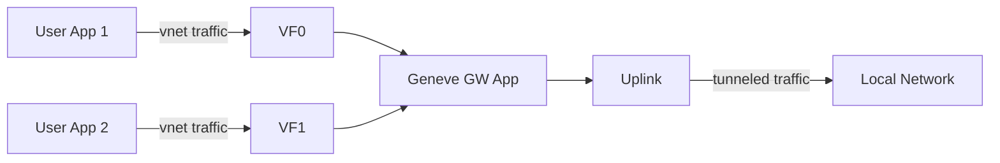

# DOCA Geneve Demo

This app attaches to the ConnectX PF Uplink and multiple VF representors to perform tunneling on the user application traffic and ensure tenant isolation.

Tenant traffic may include kernel-bypass technologies such as DPDK and RoCE.

_Note: Although these instructions are tuned for running on a host with a ConnectX SmartNIC installed, this application works equally well on a BlueField DPU. Because the BF NIC in its DPU configuration already defaults to Switchdev mode, the setup is actually simpler._

## Traffic Flow



## Host Setup

These instructions assume two hosts, creatively named `host1` and `host2`, potentially connected by an L2 switch.

Some amount of Hugepage memory is required for application initialization.
```
-- all hosts --
/opt/mellanox/dpdk/bin/dpdk-hugepages.py -r2G
```

The following steps assume the network device was named `enp23s0f0np0` at startup, and enumerated as `0000:17:00.0` on the PCI bus. Replace as necessary.

Each host must have its ConnectX device configured for SRIOV SwitchDev mode, as detailed [here](https://docs.nvidia.com/networking/pages/viewpage.action?pageId=80593054) and outlined below. (TODO: Ensure the representor netdevices are named something better than eth0, eth1, etc.)

_Note: Skip this step if running on a BlueField DPU._
```
-- all hosts --
echo 0 > /sys/class/net/enp23s0f0np0/device/sriov_numvfs
echo switchdev > /sys/class/net/enp23s0f0np0/compat/devlink/mode
```

Create and configure the tenant networks. Note this step may vary by Linux distro. Replace the `2` below with the desired number of tenant networks.
```
echo 2 > /sys/class/net/enp23s0f0np0/device/sriov_numvfs

-- For each host XX, tenant YY --
ip addr add [hostXX-vmYY-ip]/24 dev enp23s0f0v0

-- all hosts --
ip link set dev enp23s0f0v0 up
ip link set dev enp23s0f0v1 up
ip link set dev eth0 up
```


## Building the Geneve Application

The app uses the Meson build-generator system and depends on the `doca-sdk` package.
```
meson build
ninja -C build
```

## Running the Geneve Application

Start the gateway app on the host
```
build/doca-geneve-demo -a17:00.0,dv_flow_en=2,representor=vf[0-63] -c0x3
(CTRL-C to exit)
```

Generate Traffic on the virtual networks:

```
host1:
ib_send_bw -d mlx5_2  -x 3 --run_infinitely --report_gbits --connection=RC --tclass=96

host2:
ib_send_bw -d mlx5_2  -x 3 --run_infinitely --report_gbits --connection=RC --tclass=96 [host1-vm1-ip]
```
